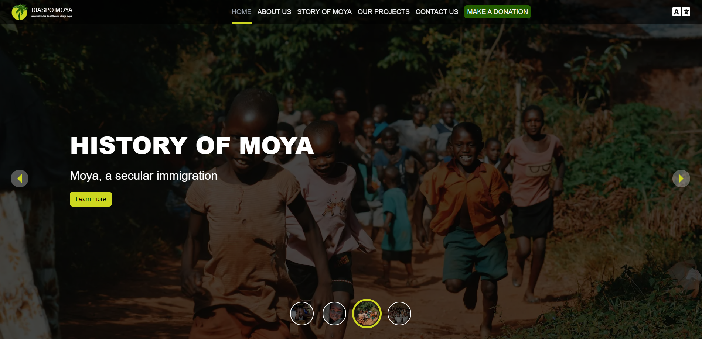

# 🌟 Diaspo Moya



A modern, internationalized website for the diaspora community, built with Next.js, focusing on connectivity and cultural engagement.

## ✨ Features

- 🌐 Multi-language support with next-intl
- 🎨 Responsive design with Tailwind CSS
- ✨ Smooth @midudev/tailwind-animations
- 📱 Mobile-first approach
- ♿ WCAG 2.1 compliant accessibility
- 🤝 Community connection features
- 📊 Cultural events calendar

## 🚀 Tech Stack

- **Frontend Framework:** Next.js 14
- **Styling:** Tailwind CSS
- **Animations:** @midudev/tailwind-animations
- **Icons:** React Icons
- **Internationalization:** next-intl
- **Language:** JavaScript

## 📥 Installation

1. Clone the repository:
```bash
git clone https://github.com/makombengas/diaspo-moya.git
cd diaspo_moya
```

2. Install dependencies:
```bash
npm install
# or
yarn install
```

3. Run the development server:
```bash
npm run dev
# or
yarn dev
```

## 📂 Project Structure

```
diaspo-moya/
|──src/
│   ├── app/ 
|   |   ├── [locale]/   
│   │   ├── page.js
│   │   └── layout.js 
|   ├── components/
│   |    ├── carousel/
│   |    ├── navbar
|   |    ├── topBanner
│   └── notFound.jsx/
├── i18n/
│   ├── request.js/
│   └── routing.js/
├────
│   ├── config.js/
│   └── Middleware.js/
├── styles/
│   └── globals.css
└── public/
|   └── images/
└── messages/
    ├── de.json/
    └── en.json/    
    └── fr.json/

```

## 🔧 Configuration

### Tailwind Configuration

```javascript
// tailwind.config.js
module.exports = {
  content: [
    './app/**/*.{js,jsx}',
    './components/**/*.{js,jsx}',
  ],
  theme: {
    extend: {
      colors: {
        // Add your custom colors here
      },
      fontFamily: {
        // Add your custom fonts here
      },
    },
  },
  plugins: [],
}
```

### Internationalization Setup

```javascript
// middleware.js
import createMiddleware from 'next-intl/middleware';

export default createMiddleware({
  locales: ['en', 'es', 'fr'],
  defaultLocale: 'en'
});

export const config = {
  matcher: ['/((?!api|_next|.*\\..*).*)']
};
```


## 📄 IMAGE License

This project is licensed under the MIT License - see the [LICENSE]([https://unsplash.com/]) file for details.

## 📄 License

This project is licensed under the MIT License - see the [LICENSE]([https://diaspomoya.org/]) file for details.

